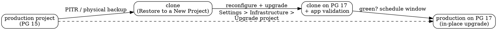

## What you will do

Upgrade a Supabase project to a new Postgres major version (e.g. 15 -> 17)
with minimal risk, in two tracks:

1. **Rehearse** on a throwaway clone made with *Restore to a New Project*,
   upgraded to the target version, validated with your app.
2. **Run** the real thing as an **in-place upgrade** on production - same
   project, same URL, same keys, zero reconfiguration.

Prerequisites: a paid plan (physical backups enabled; PITR recommended), the
Supabase dashboard, and optionally `rclone` or `aws-cli` if your rehearsal
needs real storage files. Behaviour in this guide was validated against the
live platform on 2026-07-29 (clone from PITR, then byte-level and config-level
checks on the clone); anything not re-verifiable by you in an hour is marked
as such.

The most important thing to understand before starting: **the clone flow and
the in-place upgrade are completely different animals.** A clone is a *new
project* - new project ref, new API keys, new JWT secret, and a pile of
project-level settings that do not come along. The in-place upgrade swaps the
instance underneath your *existing* project - nothing about how clients
connect changes. Do not mix the two checklists.



## What carries over and what does not

Validated 2026-07-29 by seeding a source project (public + private buckets,
custom schema exposed in the Data API, `pgjwt`, a live `pg_cron` job, SMTP
markers) and restoring it to a new project. The "clone" column is measured;
the "in-place" column follows from the upgrade being a same-project instance
swap.[^sb-upgrading][^sb-clone]

| Item | In-place upgrade (prod) | Restore to a New Project (clone) |
|---|---|---|
| Project ref / API URL | unchanged | NEW - update client env |
| anon / service API keys | unchanged | NEW |
| JWT signing secret | unchanged | NEW (existing sessions invalid on the clone) |
| Schema, data, indexes, roles | upgraded in place | copied |
| `auth.users` (accounts, hashed passwords) | kept | copied |
| Vault / encryption root key | kept | copied |
| Compute + disk attributes | unchanged | mirrors source at clone time |
| Region | unchanged | same as source |
| Storage buckets + object metadata | untouched | copied |
| **Storage file bytes** | untouched | **NOT copied - pre-existing files 404** |
| Auth settings (SMTP, templates, site/redirect URLs) | untouched | NOT copied - reset to defaults |
| Data API exposed schemas | untouched | NOT copied - reset to `public,graphql_public` |
| Edge Functions + secrets | untouched | NOT copied |
| Realtime settings | untouched | NOT copied |
| Read replicas | must DELETE before, recreate after | NOT copied |
| Deprecated extensions (e.g. `pgjwt` on PG 17) | must drop before | carried - drop on the clone too |
| `pg_cron` / `pg_net` jobs | n/a | carried **and still active** - disable on clones |
| Custom roles with md5 passwords | reset or they fail post-upgrade | same on the clone after its upgrade |
| Logical replication slots | must drop before | n/a |

Three of these deserve their own sections because they surprise everyone.

### Storage: metadata copies, bytes do not

Object URLs are constructed from the project that serves the request - they
are not stored as absolute URLs - so on a clone every file *appears* under
the new project ref and the dashboard looks complete. But the bytes live in
S3 keyed by the source project and are not copied:[^sb-dashboard-restore]

- pre-existing files return **404** under the clone's ref (public URLs,
  nested paths, and signed URLs alike);
- files you upload **to** the clone work fine;
- deleting the source project breaks every old file on the clone.

If your rehearsal needs the real files, sync them over the S3-compatible
endpoint (per-project access keys under Settings > Storage):

```bash
export AWS_ACCESS_KEY_ID=... AWS_SECRET_ACCESS_KEY=...
# download from source, then upload to clone (or rclone remote-to-remote)
aws s3 sync s3://my-bucket ./restore-staging \
  --endpoint-url https://SOURCE_REF.supabase.co/storage/v1/s3
aws s3 sync ./restore-staging s3://my-bucket \
  --endpoint-url https://CLONE_REF.supabase.co/storage/v1/s3
```

Bucket metadata is already on the clone, so the targets exist. If the
rehearsal only needs the API surface (upload + retrieval paths), skip the
sync and treat old-file 404s as expected.

### Data API schema exposure is project config, not data

The *Exposed schemas* setting (Settings > API) is PostgREST `db_schema`
configuration, which is project-level config - it is not in Postgres, so a
physical restore cannot carry it. Your schemas, tables, and data all arrive;
the clone just does not *expose* them until you re-add them under
Settings > API. Symptom if you forget: `PGRST106` / "schema not exposed"
errors from the Data API against an otherwise perfectly restored database.
The same applies to every Auth setting - SMTP credentials, email templates,
site URL, redirect URLs - all reset to defaults on a clone.

### pg_cron jobs come along running

Extensions themselves are in the database, so they copy - including
deprecated ones like `pgjwt` (which then blocks the clone's own PG 17
upgrade until dropped). More dangerously, `pg_cron` jobs copy **active**: a
clone of production will happily fire production cron jobs a second time.
Disable them before anything else:

```sql
select cron.unschedule(jobid) from cron.job;           -- or selectively:
select cron.alter_job(<jobid>, active := false);
```

The same caution applies to `pg_net`, `wrappers`, and anything else that
performs external side effects.[^sb-clone]

## Part 1: rehearsal on a clone

Zero user impact. Do this even if the production run feels trivial - the
clone upgrade previews the exact blocker list and time estimate the
production upgrade will show you.

1. **Clone.** Source project -> Database -> Backups -> *Restore to a New
   Project* -> pick the latest PITR point (or a daily backup). Note the cost
   preview: the clone mirrors your source's current compute and bills until
   deleted. A clone cannot itself be a clone source.[^sb-clone]
2. **Sanitize the clone** (before it does anything):
   - unschedule / deactivate `pg_cron` jobs (they copied over active),
   - drop `pgjwt` and any other extension deprecated on your target version,
   - drop leftover logical replication slots, if any.
3. **Reconfigure the clone** (the part that is always manual):
   - new API keys -> your preview/staging deployment env,
   - SMTP provider + sender details (Auth > SMTP),
   - re-expose custom schemas (Settings > API),
   - email templates, site URL, redirect URLs.
4. **Optionally sync storage bytes** (see above) if validation needs them.
5. **Upgrade the clone**: Settings > Infrastructure > *Upgrade project* ->
   target version. Read the blocker list and the downtime estimate *before*
   confirming - this is the same pre-flight the production project will get.
6. **Validate with your app** against the target Postgres version:
   - login flow + JWKS endpoint,
   - your heaviest write paths,
   - storage upload and retrieval,
   - any custom-schema Data API calls,
   - watch the query logs for plan regressions.
7. Green -> schedule the production window. Red -> you just saved your
   production window; debug on the clone.

If you want a production-data seed for preview branches instead of the clone
flow, the documented one-liner is
`supabase db dump --data-only --linked > supabase/seed.sql` - branches run
`seed.sql` once at creation.[^sb-cli-workflows][^sb-branching]

## Part 2: production upgrade (in-place)

Everything in the reconfiguration list above is **irrelevant here** - the
project, URL, keys, JWT secret, auth settings, and storage stay exactly as
they are. What changes is the Postgres version (and the rest of the service
stack images). Mechanics: the project goes offline, a new instance is
provisioned, data is copied (GP3 default: ~100 Mbps, so ~1 minute per GB of
disk), `pg_upgrade` runs, platform validations run, a base backup is taken,
and the project comes back. If the upgrade fails, the original database is
brought back online automatically.[^sb-upgrading]

### T-7 days

- [ ] Announce the maintenance window to users (for small databases the real
      downtime is minutes, but budget for validation).
- [ ] Pick the window: your users' quietest hours; avoid Friday/weekend.
- [ ] Run your own readiness review: enabled extensions vs the deprecated
      list, `reg*` data types referencing system OIDs, logical replication
      slots, custom roles with md5 passwords (`pg_authid.rolpassword LIKE
      'md5%'`), unused indexes / bloat (smaller DB = shorter window). The
      dashboard surfaces hard blockers on the upgrade screen itself.[^sb-upgrading]

### T-1 day

- [ ] Drop deprecated extensions (for PG 17: `pgjwt`, `plcoffee`, `plls`,
      `plv8` - drop them from the dashboard's database extensions page).
- [ ] Delete read replicas (projects with replicas cannot be upgraded; you
      will recreate them after). Make sure the app tolerates reading from
      the primary in the meantime.
- [ ] Take a fresh `pg_dump` logical backup - belt and braces on top of
      physical backups / PITR.
- [ ] Prepare your write-stop (maintenance page, deploy freeze, queue
      pause - whatever stops writes cleanly).

### In the window

- [ ] Stop application writes.
- [ ] Settings > Infrastructure > *Upgrade project* -> target version. The
      dashboard's estimate is the authoritative downtime figure.
- [ ] Watch it through; keep the rollback fact in mind (failure restores the
      original DB).

### Post-upgrade, same window

- [ ] Validate auth first (login + JWKS), then your heaviest write paths.
- [ ] Recreate read replicas -> they get **new connection strings** ->
      update app env.
- [ ] Reset passwords of any custom md5 roles to rehash as scram-sha-256.
- [ ] Check extension versions and the slow-query log for plan regressions.
- [ ] Re-enable writes.

### Days after

- [ ] Keep monitoring (advisors, slow queries, error rates) before declaring
      done.
- [ ] Delete the rehearsal clone - it bills at mirrored compute until you do.

## Verification

| Check | How | Expected |
|---|---|---|
| Clone is a faithful data copy | compare row counts / spot-check marker rows | identical |
| Clone storage metadata | list buckets + objects via API | all present |
| Clone storage bytes | GET a pre-existing object via clone ref | **404** (expected, not a bug) |
| Clone upload path | PUT then GET a new object | 200 / 200 |
| Clone config gaps | Settings > API, Auth > SMTP | defaults; re-entered values stick |
| Clone upgrade pre-flight | upgrade screen blocker list | only known blockers (e.g. `pgjwt`) |
| Prod post-upgrade | `show server_version` via psql | target version |
| Prod identity | API URL, keys, JWT secret | unchanged |
| Replica recreated | app env holds new replica string | reads flowing |

## Gotchas and lessons learned

- **Do not confuse the two flows.** Clone = new project + reconfiguration.
  In-place upgrade = same project, no reconfiguration. Nearly every "upgrade
  checklist" mistake is applying one flow's steps to the other.
- **A clone's dashboard looks complete for storage.** It is not - bytes are
  missing. Test a GET, not the listing.
- **`pg_cron` on clones is a production hazard.** Jobs copy active and will
  double-fire (emails, webhooks, billing jobs) until unscheduled.
- **Schema exposure and SMTP are the two most-forgotten reconfigurations** -
  both fail silently-ish: the API 404s on your custom schema, and auth
  emails fall back to the rate-limited built-in sender.
- **Disk only grows.** Auto-resize never shrinks back down; if the upgrade
  resizes your disk upward, that is your new floor.[^sb-compute-disk]
- **The clone mirrors compute at clone time.** If you resized production
  after your last clone, your next clone lands on the new size and bills
  accordingly.
- **The upgrade keeps your compute size.** It is a version change, not a
  resize.
- **The same in-place process covers minor and future major versions** (e.g.
  PG 18 when it becomes available as a target).[^sb-upgrading]
- **Restore-to-new-project is dashboard-only** - there is no Management API
  or CLI path for it as of 2026-07 (the API only restores in place).
  Re-verify before scripting around it.

## References

[^sb-upgrading]: Supabase, "Upgrading," Supabase Docs. https://supabase.com/docs/guides/platform/upgrading
[^sb-clone]: Supabase, "Restore to a new project," Supabase Docs. https://supabase.com/docs/guides/platform/clone-project
[^sb-dashboard-restore]: Supabase, "Restore Dashboard backup - Migrate storage objects," Supabase Docs. https://supabase.com/docs/guides/platform/migrating-within-supabase/dashboard-restore
[^sb-cli-workflows]: Supabase, "CLI workflows," Supabase Docs. https://supabase.com/docs/guides/local-development/cli-workflows
[^sb-branching]: Supabase, "Working with branches - Seeding behavior," Supabase Docs. https://supabase.com/docs/guides/deployment/branching/working-with-branches
[^sb-compute-disk]: Supabase, "Compute and Disk," Supabase Docs. https://supabase.com/docs/guides/platform/compute-and-disk
