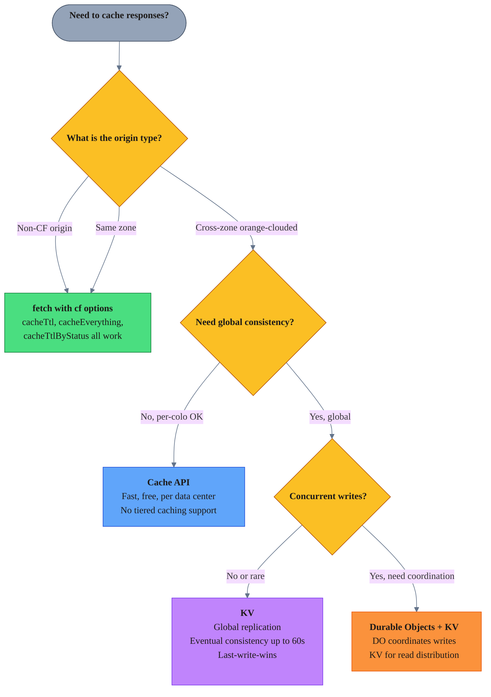
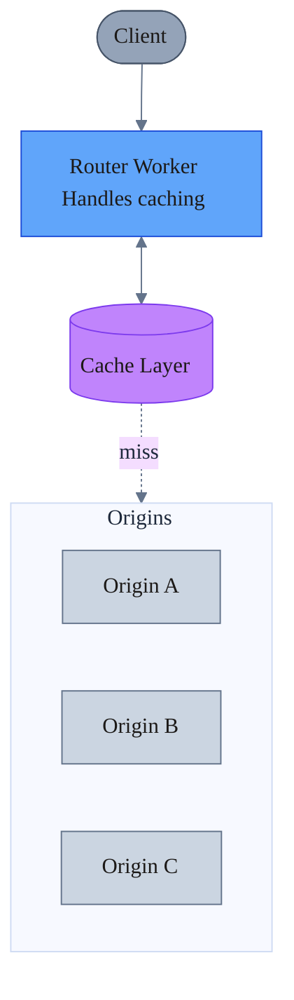
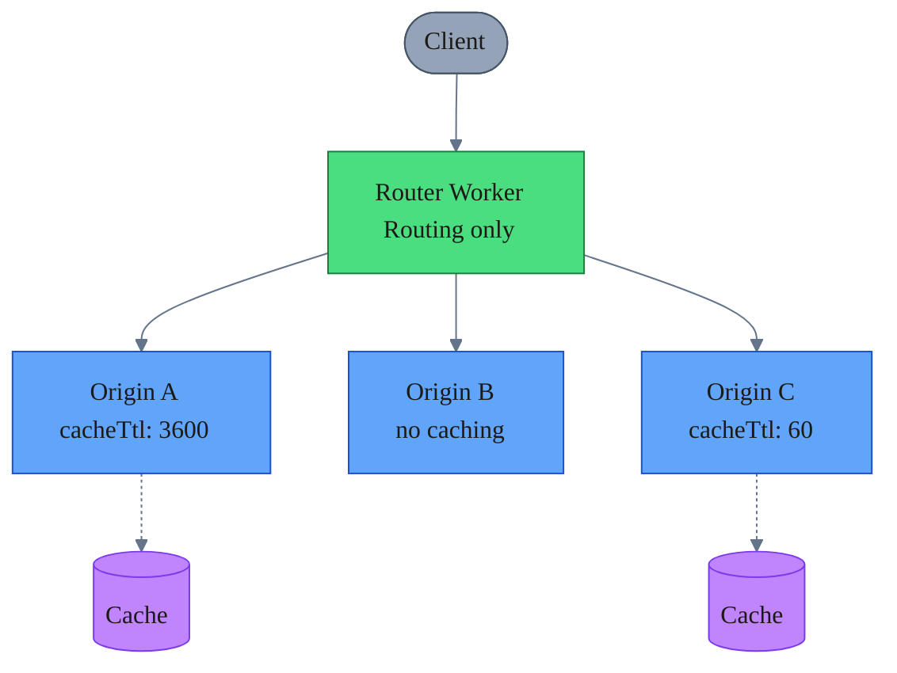

import { Aside } from "@astrojs/starlight/components";

How caching behaves when Workers fetch from orange-clouded origins on different zones.

`cf` caching options (`cacheTtl`, `cacheEverything`, `cacheTtlByStatus`) are ignored for cross-zone orange-clouded origins. `cf.image` still works.

## Why this happens

From [How the Cache works](https://developers.cloudflare.com/workers/reference/how-the-cache-works/#fetch):

> "First, `fetch` checks to see if the URL matches a different zone. If it does, it reads through that zone's cache (or Worker). Otherwise, it reads through its own zone's cache, even if the URL is for a non-Cloudflare site."

Requests to cross-zone orange-clouded origins route to that zone's edge, not your zone's cache.

From [Cache using fetch](https://developers.cloudflare.com/workers/examples/cache-using-fetch/):

> "Workers operating on behalf of different zones cannot affect each other's cache. You can only override cache keys when making requests within your own zone... or requests to hosts that are not on Cloudflare. When making a request to another Cloudflare zone (for example, belonging to a different Cloudflare customer), that zone fully controls how its own content is cached within Cloudflare; you cannot override it."

Intentional security boundary - one zone can't manipulate another's cache.

## How caching actually works

Three layers influence caching behavior:

1. **Origin response headers** (`Cache-Control`, `Expires`)
2. **Cloudflare zone settings** (Cache Rules, Edge TTL, Browser TTL)
3. **Worker `cf` options** (`cacheTtl`, `cacheEverything`, `cacheTtlByStatus`)

### Default behavior (no `cf` options, no Cache Rules)

When fetching from **same-zone or non-CF origins** without `cf` options, [default caching](https://developers.cloudflare.com/cache/concepts/default-cache-behavior/) applies:

| Scenario | Cached? | Why |
|----------|---------|-----|
| Static file extension (.js, .css, .png, etc.) | Yes | [Default cacheable extensions](https://developers.cloudflare.com/cache/concepts/default-cache-behavior/#default-cached-file-extensions) |
| HTML, JSON, or other content | **No** | Not in default extension list |
| Non-default type with `Cache-Control: public, max-age=3600` | **No** | Cloudflare caches by extension, not MIME type - need `cf` options |
| Origin returns `Cache-Control: no-store` or `private` | No | Explicitly non-cacheable |
| Response has `Set-Cookie` header | Depends | With `cacheTtl`: cached, cookie removed. With `cacheEverything` alone: not cached, cookie preserved. See [docs](https://developers.cloudflare.com/cache/concepts/cache-behavior/#interaction-of-set-cookie-response-header-with-cache) |

`Cache-Control` headers control *how long* something is cached, not *whether* it gets cached. Non-default types need `cf` options or a Cache Rule.

<Aside type="caution" title="Cross-zone is different">
For cross-zone orange-clouded origins, your `cf` caching options are ignored - the request is routed to the origin zone's edge, bypassing your zone's cache entirely. If the origin Worker generates responses directly (e.g., HTML in code), there's no `CF-Cache-Status` header since it doesn't go through the CDN cache.
</Aside>

### With `cf` options (same zone or non-CF origin)

| cf Option | Effect |
|-----------|--------|
| `cacheEverything: true` | Cache regardless of file extension (respects origin's `Cache-Control` for TTL) |
| `cacheTtl: 3600` | Force cache for 1 hour (implicit `cacheEverything`, ignores origin headers) |
| `cacheTtlByStatus: { "200-299": 3600 }` | Force cache with TTL by status code (implicit `cacheEverything`) |

`cacheTtl` and `cacheTtlByStatus` implicitly enable `cacheEverything`. Difference: `cacheEverything` alone respects origin's `Cache-Control` for TTL, while `cacheTtl`/`cacheTtlByStatus` override it.

These options only work for same-zone or non-CF origins. Ignored cross-zone.

### Cross-zone behavior

When fetching cross-zone orange-clouded origins:

1. The request goes to the **origin zone's edge**, not yours
2. The origin zone's Cache Rules and settings apply
3. Your `cf` options are ignored
4. If the origin zone has caching enabled, the origin's `Cache-Control` headers control TTL

This means if you want caching, the **origin zone** must configure it via:
- Cache Rules on the origin zone (to enable caching for non-default types)
- A Worker on the origin zone with `cf` options
- For default cacheable extensions, `Cache-Control` headers control TTL

## cf options compatibility

| cf Option | Non-CF / Same Zone | Cross-Zone |
|-----------|-------------------|------------|
| `cacheTtl`, `cacheEverything`, `cacheTtlByStatus` | Yes | **No** |
| `image` | Yes | **Yes** |
| `polish`, `minify`, `mirage` | Yes | **No** (uses origin zone) |

## Workarounds

### Cache API

Stores responses in the calling Worker's zone cache, bypassing cross-zone restrictions.

```typescript
async function fetchWithCache(request: Request, originUrl: string): Promise<Response> {
  const cache = caches.default;
  const cacheKey = new Request(originUrl, { method: 'GET' });
  
  // Check cache first
  let cached = await cache.match(cacheKey);
  
  if (cached) {
    // Handle cache bypass (e.g., browser refresh)
    const cacheControl = request.headers.get('Cache-Control');
    const shouldBypass = cacheControl?.includes('no-cache');
    
    if (shouldBypass) {
      // Cancel the body stream to avoid resource leaks
      if (cached.body) {
        await cached.body.cancel();
      }
      cached = undefined;
    } else {
      return cached;
    }
  }
  
  // Fetch from origin
  const originResp = await fetch(originUrl);
  
  // Don't cache error responses
  if (!originResp.ok) {
    return originResp;
  }
  
  // Prepare response for caching
  const headers = new Headers(originResp.headers);
  headers.delete('Set-Cookie'); // Cache API rejects responses with Set-Cookie
  
  if (!headers.has('Cache-Control')) {
    headers.set('Cache-Control', 'public, max-age=3600');
  }
  
  const response = new Response(originResp.body, {
    status: originResp.status,
    headers,
  });
  
  // Store in cache (non-blocking)
  // Note: cache.put() is best-effort, no need to await
  cache.put(cacheKey, response.clone());
  
  return response;
}
```

### KV for global consistency

For global replication with eventual consistency (up to 60s).

```typescript
async function fetchWithKV(originUrl: string, env: Env): Promise<Response> {
  const cacheKey = new URL(originUrl).pathname;
  
  // Check KV first - store body as arrayBuffer, metadata separately
  const { value, metadata } = await env.CACHE_KV.getWithMetadata<{
    contentType: string;
    status: number;
  }>(cacheKey, 'arrayBuffer');
  
  if (value && metadata) {
    return new Response(value, {
      status: metadata.status,
      headers: { 'Content-Type': metadata.contentType },
    });
  }
  
  // Fetch from origin
  const response = await fetch(originUrl);
  
  if (!response.ok) {
    return response;
  }
  
  // Store in KV: body as value, headers as metadata
  const body = await response.arrayBuffer();
  const contentType = response.headers.get('Content-Type') || 'application/octet-stream';
  
  // Non-blocking write
  env.CACHE_KV.put(cacheKey, body, { 
    expirationTtl: 3600,
    metadata: { contentType, status: response.status },
  });
  
  return new Response(body, {
    status: response.status,
    headers: { 'Content-Type': contentType },
  });
}
```

<Aside type="caution" title="Don't mix Cache API and KV">
Choose one caching strategy per data type. Mixing them creates complexity and potential inconsistency.
</Aside>

## Decision tree

When to use which caching approach:



| Option | Use when | Latency | Consistency | Notes |
|--------|----------|---------|-------------|-------|
| `fetch()` + `cf` | Non-CF or same zone | ~0ms | Per-colo | [Docs](https://developers.cloudflare.com/workers/examples/cache-using-fetch/) |
| Cache API | Cross-zone, per-colo OK | ~0ms | Per-colo | [No tiered caching](https://developers.cloudflare.com/workers/runtime-apis/cache/) |
| KV | Cross-zone, global | ~0ms cached | Eventual 60s | [Docs](https://developers.cloudflare.com/kv/concepts/how-kv-works/) |

<Aside type="note" title="Coordinating KV writes">
KV uses last-write-wins semantics. Use [Durable Objects](https://developers.cloudflare.com/durable-objects/) to coordinate writes and prevent race conditions.
</Aside>

## Microservices architecture

In multi-Worker systems (router → origin services), there are two caching approaches:

### Centralized caching (router handles all)



**Which caching mechanism to use in the router:**

| Origin Type | Caching Mechanism | Why |
|-------------|-------------------|-----|
| Not proxied (grey-clouded, non-CF) | `fetch()` with `cf` options | Traffic doesn't go through CF proxy |
| Orange-clouded (same zone) | `fetch()` with `cf` options | Same zone, `cf` options work |
| Orange-clouded (cross-zone) | Cache API or KV | `cf` options ignored, must cache explicitly |

| Pros | Cons |
|------|------|
| Single cache management point | Router becomes bottleneck |
| Consistent behavior | Extra hop latency |
| Easier debugging | Tight coupling to origins |
| Centralized circuit breakers | Router must know all origin semantics |

### Distributed caching (origins decide)



| Pros | Cons |
|------|------|
| Each service owns its strategy | Inconsistent behavior |
| No single point of failure | Harder to debug system-wide |
| Independent deployments | Complex invalidation |
| Better separation of concerns | Duplicate logic |

### Recommendation

**Prefer distributed caching for cross-zone Worker architectures:**

1. **Router stays stateless** - routing logic only
2. **Origins control their own caching** - using `cf` options or Cache Rules (for non-default types)
3. **If edge caching needed**, router uses Cache API (since `cf` options are ignored anyway)

Why this works:
- `cf` options are ignored cross-zone anyway
- Origins know their own caching needs
- Simpler router = fewer failure modes

### Origin-side caching

Origin Workers cache upstream responses with `cf` options (same zone) and signal cacheability to downstream via headers:

```typescript
// Origin Worker - fetches from upstream API and caches at origin's edge
export default {
  async fetch(request: Request): Promise<Response> {
    // Fetch from upstream with cf options (same zone or non-CF = works)
    // cacheTtl implicitly enables cacheEverything (JSON not cached by default)
    const upstream = await fetch('https://api.example.com/data', {
      cf: { cacheTtl: 3600 },
    });
    
    // Worker-generated responses bypass CDN cache
    // Cache-Control tells downstream (router, browser) how long to cache
    return new Response(upstream.body, {
      status: upstream.status,
      headers: {
        'Content-Type': 'application/json',
        'Cache-Control': 'public, max-age=3600',
      },
    });
  },
};
```

**Two levels of caching here:**
1. **CDN cache** (via `cf` options) - caches the upstream API response at this zone's edge
2. **Downstream cache** (via `Cache-Control` header) - tells the calling Worker/browser how long to cache this response

For details on how `Cache-Control` headers interact with Cloudflare, see [Origin Cache Control](https://developers.cloudflare.com/cache/concepts/cache-control/).

<Aside type="tip" title="When to centralize">
Use centralized caching when:
- **Origins are third-party APIs** you don't control (can't set Cache Rules or `cf` options on their zone)
- **Origins return `no-store` or `private`** but you know the data is safe to cache
- **You need to aggregate** responses from multiple origins into a single cached response
- **Origins are grey-clouded** or non-Cloudflare and you want edge caching without changing origin config
</Aside>
