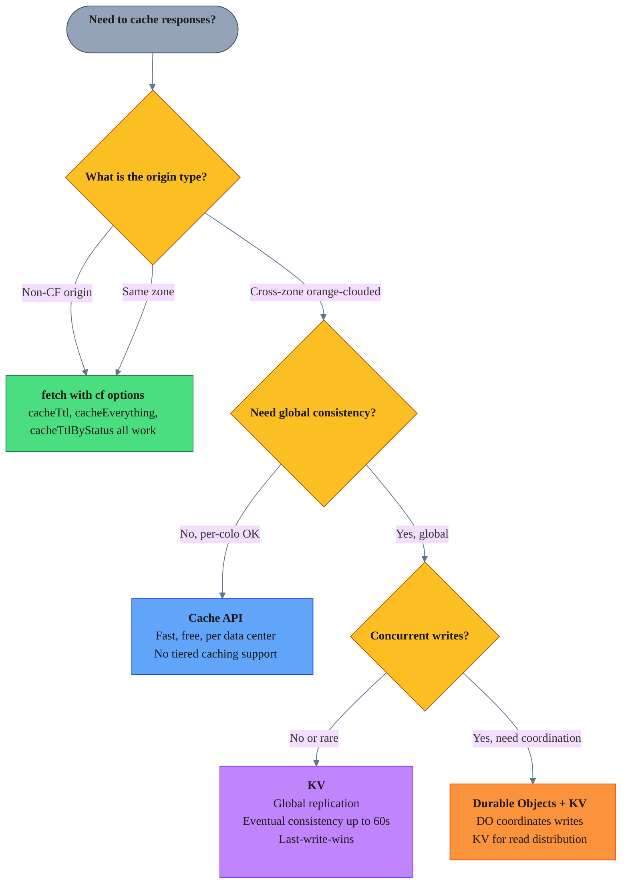
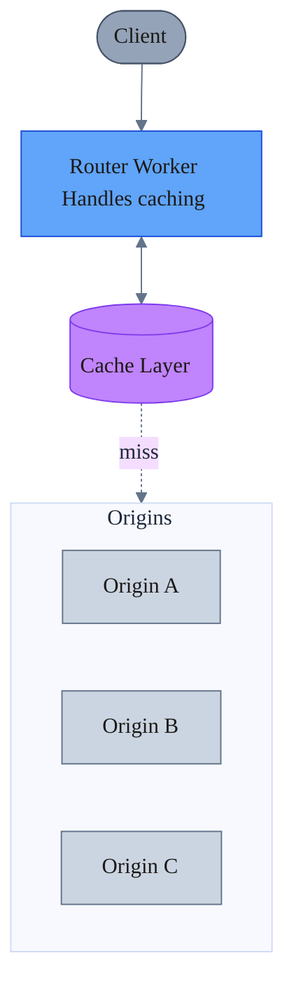
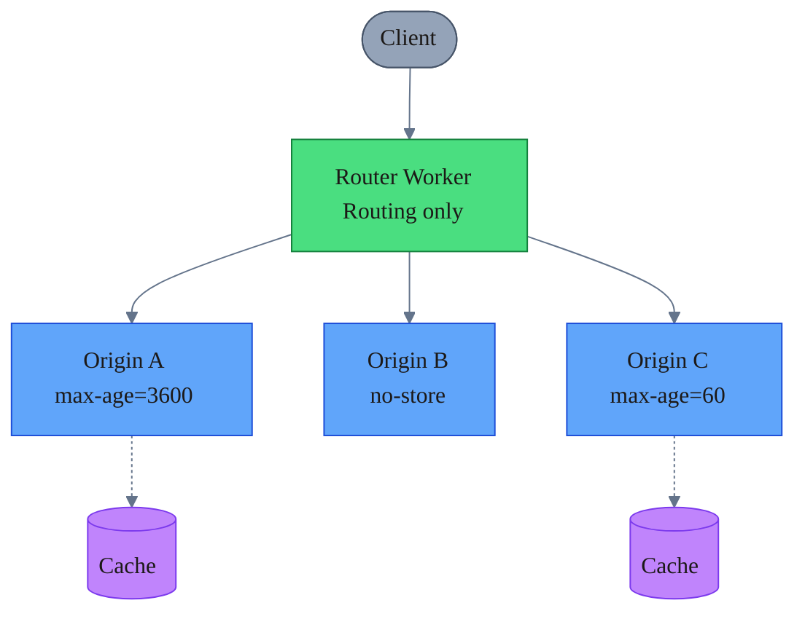

import { Aside } from "@astrojs/starlight/components";

How caching behaves when a Cloudflare Worker makes `fetch()` requests to origins proxied through Cloudflare (orange-clouded) on different zones.

**Key insight:** The `cf` caching options (`cacheTtl`, `cacheEverything`, `cacheTtlByStatus`) are ignored for all cross-zone orange-clouded origins. Transformation options like `cf.image` still work.

## Why this happens

From [How the Cache works](https://developers.cloudflare.com/workers/reference/how-the-cache-works/#fetch):

> "First, `fetch` checks to see if the URL matches a different zone. If it does, it reads through that zone's cache (or Worker). Otherwise, it reads through its own zone's cache, even if the URL is for a non-Cloudflare site."

This means requests to cross-zone orange-clouded origins are routed to that zone's edge, not your zone's cache.

From [Cache using fetch](https://developers.cloudflare.com/workers/examples/cache-using-fetch/):

> "Workers operating on behalf of different zones cannot affect each other's cache. You can only override cache keys when making requests within your own zone... or requests to hosts that are not on Cloudflare. When making a request to another Cloudflare zone (for example, belonging to a different Cloudflare customer), that zone fully controls how its own content is cached within Cloudflare; you cannot override it."

This is an intentional security boundary - one zone cannot manipulate another zone's cache behavior.

## cf options compatibility

| cf Option | Non-CF / Same Zone | Cross-Zone |
|-----------|-------------------|------------|
| `cacheTtl`, `cacheEverything`, `cacheTtlByStatus` | Yes | **No** |
| `image` | Yes | **Yes** |
| `polish`, `minify`, `mirage` | Yes | **No** (uses origin zone) |

## Workarounds

### Cache API

The Cache API stores responses in the calling Worker's zone cache, bypassing cross-zone restrictions entirely.

```typescript
async function fetchWithCache(originUrl: string): Promise<Response> {
  const cache = caches.default;
  const cacheKey = new Request(originUrl, { method: 'GET' });
  
  const cached = await cache.match(cacheKey);
  if (cached) {
    const response = new Response(cached.body, cached);
    response.headers.set('X-Cache', 'HIT');
    return response;
  }
  
  const originResp = await fetch(originUrl);
  const headers = new Headers(originResp.headers);
  headers.delete('Set-Cookie'); // Required - cache.put() rejects Set-Cookie
  
  if (!headers.has('Cache-Control')) {
    headers.set('Cache-Control', 'public, max-age=3600');
  }
  
  const response = new Response(originResp.body, { status: originResp.status, headers });
  response.headers.set('X-Cache', 'MISS');
  
  await cache.put(cacheKey, response.clone());
  
  return response;
}
```

### KV for global consistency

Use KV when you need cached data replicated globally (eventual consistency, up to 60s).

```typescript
async function fetchWithKV(originUrl: string, env: Env): Promise<Response> {
  const cacheKey = new URL(originUrl).pathname;
  
  const cached = await env.CACHE_KV.get(cacheKey, 'arrayBuffer');
  if (cached) {
    return new Response(cached, {
      headers: { 'X-Cache': 'HIT', 'Content-Type': 'application/octet-stream' }
    });
  }
  
  const response = await fetch(originUrl);
  const body = await response.arrayBuffer();
  
  await env.CACHE_KV.put(cacheKey, body, { expirationTtl: 3600 });
  
  return new Response(body, {
    headers: { 'X-Cache': 'MISS', 'Content-Type': response.headers.get('Content-Type') || '' }
  });
}
```

<Aside type="caution" title="Don't mix Cache API and KV">
Choose one caching strategy per data type. Mixing them creates complexity and potential inconsistency.
</Aside>

## Decision tree

When to use which caching approach:



| Option | Use when | Latency | Consistency | Notes |
|--------|----------|---------|-------------|-------|
| `fetch()` + `cf` | Non-CF or same zone | ~0ms | Per-colo | [Docs](https://developers.cloudflare.com/workers/examples/cache-using-fetch/) |
| Cache API | Cross-zone, per-colo OK | ~0ms | Per-colo | [No tiered caching](https://developers.cloudflare.com/workers/runtime-apis/cache/) |
| KV | Cross-zone, global | ~0ms cached | Eventual 60s | [Docs](https://developers.cloudflare.com/kv/concepts/how-kv-works/) |

<Aside type="note" title="Coordinating KV writes">
KV uses last-write-wins semantics. Use [Durable Objects](https://developers.cloudflare.com/durable-objects/) to coordinate writes and prevent race conditions.
</Aside>

## Microservices architecture

In multi-Worker systems (router → origin services), there are two caching approaches:

### Centralized caching (router handles all)



**Which caching mechanism to use in the router:**

| Origin Type | Caching Mechanism | Why |
|-------------|-------------------|-----|
| Grey-clouded (DNS only) | `fetch()` with `cf` options | Not proxied through CF, so `cf` options work |
| Orange-clouded (same zone) | `fetch()` with `cf` options | Same zone, `cf` options work |
| Orange-clouded (cross-zone) | Cache API or KV | `cf` options ignored, must cache explicitly |

| Pros | Cons |
|------|------|
| Single cache management point | Router becomes bottleneck |
| Consistent behavior | Extra hop latency |
| Easier debugging | Tight coupling to origins |
| Centralized circuit breakers | Router must know all origin semantics |

### Distributed caching (origins decide)



| Pros | Cons |
|------|------|
| Each service owns its strategy | Inconsistent behavior |
| No single point of failure | Harder to debug system-wide |
| Independent deployments | Complex invalidation |
| Better separation of concerns | Duplicate logic |

### Recommendation

**Prefer distributed caching for cross-zone Worker architectures:**

1. **Router stays stateless** - routing logic only
2. **Origins control their own caching** - using `cf` options, Cache Rules, or `Cache-Control` headers
3. **If edge caching needed**, router uses Cache API (since `cf` options are ignored anyway)

This works because:
- `cf` caching options are ignored for cross-zone origins anyway
- Origins understand their own caching needs
- Simpler router = fewer failure modes

### Origin-side caching

Since `cf` options work within the same zone, origin Workers can fully control their own caching behavior:

```typescript
// Origin Worker - controls its own caching
export default {
  async fetch(request: Request): Promise<Response> {
    const data = await getExpensiveData();
    
    // Fetch from upstream with cf options (same zone = works)
    const upstream = await fetch('https://api.same-zone.com/data', {
      cf: {
        cacheTtl: 3600,
        cacheEverything: true,
        cacheTags: ['api-data', 'v1'],
      },
    });
    
    // Set Cache-Control for downstream consumers
    return new Response(JSON.stringify(data), {
      headers: {
        'Content-Type': 'application/json',
        'Cache-Control': 'public, max-age=3600',
        'Cache-Tag': 'api-response',
      },
    });
  },
};
```

Origins can also use [Cache Rules](https://developers.cloudflare.com/cache/how-to/cache-rules/) at the zone level for declarative caching without code changes.

<Aside type="tip" title="When to centralize">
Use centralized caching when you need:
- Unified cache invalidation (purge once, affects all origins)
- Cache responses from origins that don't support caching headers
- Transform or normalize responses before caching
</Aside>
